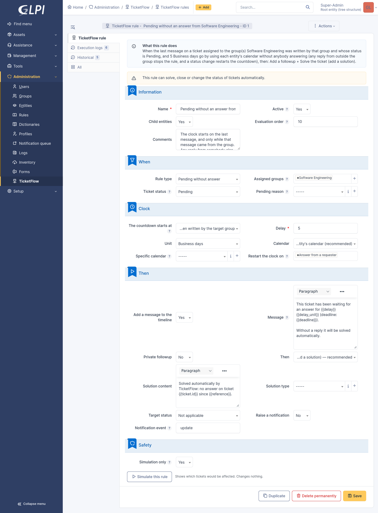
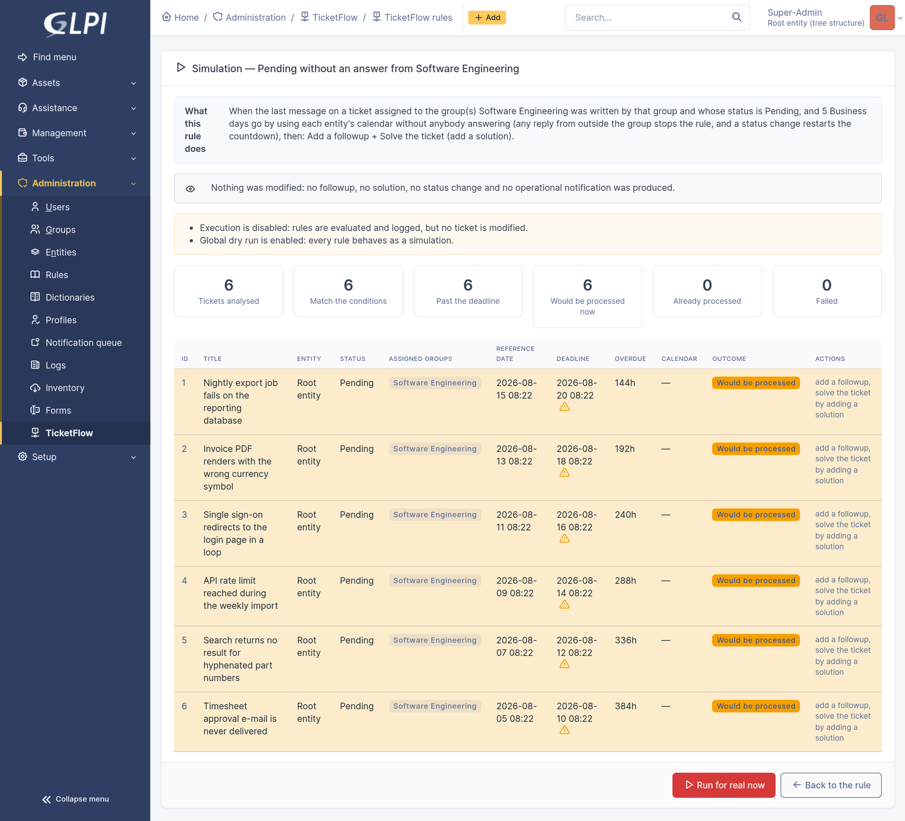
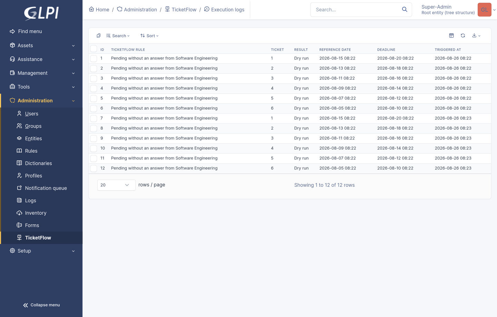
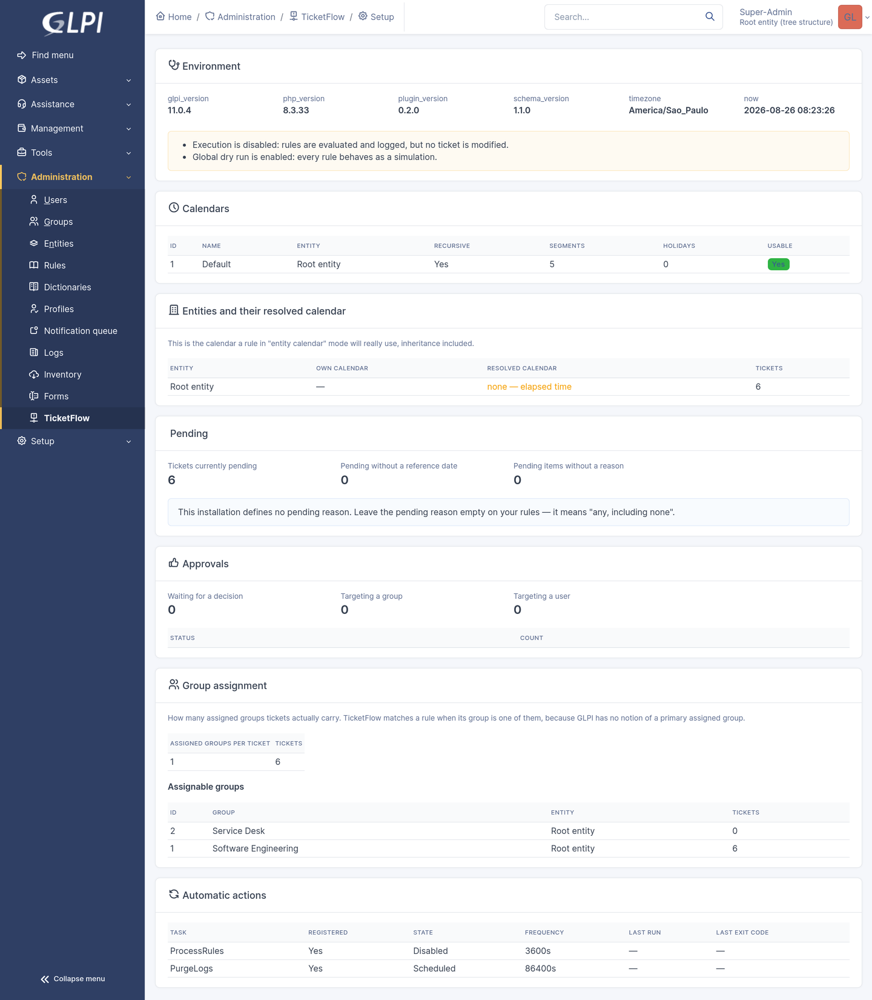

# TicketFlow

[](https://github.com/Jovinull/ticketclock/actions/workflows/continuous-integration.yml)
[](https://github.com/Jovinull/ticketclock/releases/latest)
[](https://glpi-project.org)
[](https://www.php.net)
[](LICENSE)

**A time-based automation engine for GLPI tickets.**

TicketFlow watches tickets that are waiting on somebody, measures how long they have been
waiting in *business* time, and runs configurable actions when the wait goes past a
deadline. It is a rule engine, not a hard-coded workflow: the two situations it ships with —
a pending ticket without an answer, and an approval request without a decision — are two
configurations of the same machinery.

---

## The problem it solves

Tickets that wait on somebody else quietly rot. A requester is asked for information and
never replies; an approver never opens the mail. The ticket stays open, distorts every
metric, and eventually somebody closes it by hand weeks later.

GLPI can already bump and auto-solve a pending ticket (`PendingReasonCron`), but only per
*pending reason*, only when a followup and a solution template are configured, and with no
notion of *who* was supposed to answer. A technician's reply counts the same as the
requester's.

TicketFlow adds the part that was missing:

* conditions on the **assigned group**, the status, the entity and the pending reason;
* deadlines in **business days or hours**, using GLPI's own calendars, holidays included;
* a clock that only restarts on the interaction you are actually waiting for;
* the same treatment for **approval requests**;
* a **dry run** that shows exactly which tickets would be touched, before anything is;
* a per-ticket **audit trail**, and idempotency that survives a cron running every minute.

## Compatibility

| | |
|---|---|
| GLPI | **11.0.0 → 11.0.99** |
| PHP | **8.2+** |
| Database | MySQL 8 / MariaDB 10.5+ (a `UNIQUE` index allowing multiple `NULL`s is required) |
| Core changes | **none** — TicketFlow never modifies GLPI files or core tables |

## Installation

```bash
cd /var/www/glpi/plugins
git clone https://github.com/Jovinull/ticketclock.git ticketclock
```

> The directory **must** be named `ticketclock`: GLPI derives the plugin's namespace
> (`GlpiPlugin\Ticketclock\`) and its table prefix from the folder name. The plugin is
> named TicketFlow but keyed `ticketclock` because `ticketflow` was already taken on the
> GLPI plugin catalog, where keys are unique across every published plugin.

Then either through the interface — *Setup > Plugins > TicketFlow > Install, then Enable* —
or from the CLI:

```bash
php bin/console plugin:install ticketclock
php bin/console plugin:activate ticketclock
```

Installing creates four tables (`glpi_plugin_ticketclock_rules`, `…_rulegroups`,
`…_ruleactions`, `…_executions`), registers two automatic actions and one right.

**A fresh install does nothing.** Execution is disabled, global dry run is on, the
processing task ships disabled, and rules are created inactive. Nothing can touch a ticket
until somebody deliberately turns it on.

## Configuring the cron

TicketFlow runs as a standard GLPI *Automatic action*. Nothing custom, no daemon.

*Setup > Automatic actions > `ProcessRules`* → set **Run mode** to *CLI* and the status to
*Scheduled*. Frequency defaults to hourly; anything from 5 minutes upward is fine, since
idempotency guarantees each occurrence is processed once regardless of how often the task
runs.

The external scheduler is the recommended mode in production:

```cron
* * * * * php /var/www/glpi/bin/console cron:run >/dev/null 2>&1
```

To run just this task once, by hand:

```bash
php bin/console cron:run --force ProcessRules
```

A second task, `PurgeLogs`, applies the log retention window daily.

## What it looks like

| | |
|---|---|
|  |  |
| **The rule form** — conditions, clock, actions and safety, in that order. | **A dry run** — every ticket the rule would touch, and what it would do to each. |
|  |  |
| **The execution log** — one row per ticket per occurrence, simulations included. | **Diagnostics** — what the plugin can see: calendars, entities, pending tickets, cron state. |

<sub>Captured on a demo instance seeded with invented tickets. Screenshots of this plugin
show ticket titles and group names, so they are never taken on a copy of a real
instance.</sub>

## Creating a rule

*Administration > TicketFlow > New*. The form is organised as five questions.

**Information** — name, entity, whether it applies to child entities.

**When** — the rule type, the assigned group(s), the ticket status, the pending reason.
Leaving groups empty means *any group*; a ticket matches when **one of** its assigned
groups is listed (most tickets carry several — see `docs/rules.md`).

**Clock** — where the countdown starts, the delay, its unit, which calendar to use, and
which interactions restart it.

> Two ways to start the countdown. *When the ticket entered the status* times the state.
> *Last message, when written by the target group* times the conversation: the rule applies
> only while your team wrote the last message, and goes quiet the moment anybody else
> replies. A status change restarts the countdown either way.

**Then** — an optional timeline message, one terminal action (solve / change status /
close / nothing), and an optional notification.

**Safety** — *Simulation only*, which evaluates and logs the rule without ever touching a
ticket.

### Worked example: close after five business days without an answer

| Field | Value |
|---|---|
| Rule type | Pending without answer |
| Assigned groups | your support/development group |
| Ticket status | Pending |
| The countdown starts at | **Last message, when written by the target group** |
| Delay | `5` **Business days** |
| Calendar | Entity's calendar |
| Add a message | *This ticket is being closed automatically: no answer was received within the agreed window. If you still need help, open a new ticket and we will pick it up.* |
| Then | Solve the ticket (add a solution) |

The message is a template — the text above is a suggestion, not a hard-coded string. See
[Message placeholders](#message-placeholders).

### Worked example: approval unanswered for two business days

| Field | Value |
|---|---|
| Rule type | Approval without answer |
| Ticket status | Any status |
| Delay | `2` **Business days** |
| Restart the clock on | *(nothing — an approval is answered or it is not)* |
| Add a message | a reminder for the timeline |
| Then | whatever your process requires |

## How business days work

A delay of *N business days* is computed by GLPI's own
`Calendar::computeEndDate()` — the very function that computes SLA due dates. TicketFlow
does not re-implement it. In practice:

* the **start day is not counted**: Monday 10:00 + 5 business days is *next Monday 10:00*;
* days with no opening hours (weekends, by default) and configured holidays are skipped,
  so they push the deadline out;
* if the clock starts outside opening hours, it starts at the next opening;
* the result is clamped to the last working hour of the day it lands on.

**Which calendar?** `Entity's calendar` (the default) resolves the calendar through the
entity tree exactly like the rest of GLPI. `Specific calendar` pins one. `No calendar`
opts out of business time entirely.

If no usable calendar can be found, the delay is applied as plain elapsed time — the same
fallback core's SLA code uses. That is never silent: the execution row records
`used_elapsed_fallback`, and the dry-run table flags it with a warning icon.

> Worth checking before you arm anything: a calendar can exist without any entity pointing
> at it, in which case `Entity's calendar` resolves to nothing and business days quietly
> become calendar days. Open *Diagnostics* and read the **resolved** calendar column.

*Administration > TicketFlow > Diagnostics* shows which calendar each entity actually
resolves to.

## Message placeholders

Messages accept `{{placeholder}}` slots. There is no expression language and no `eval`:
a fixed whitelist of names, each escaped before it reaches the timeline.

| Placeholder | Value |
|---|---|
| `{{ticket.id}}` `{{ticket.name}}` `{{ticket.status}}` | the ticket |
| `{{rule.name}}` | the rule that fired |
| `{{reference}}` | when the clock started |
| `{{deadline}}` | when it expired |
| `{{delay}}` `{{delay_unit}}` `{{business_days}}` | the configured delay |
| `{{calendar.name}}` | the calendar used |
| `{{group.name}}` `{{entity.name}}` | the ticket's assigned groups / entity |

An unknown placeholder is **left visible** rather than blanked, so a typo shows up in the
dry run instead of producing a hole in a customer-facing message.

### Automatic replies

An out-of-office reply reaches GLPI through the mail collector as an ordinary public followup
signed by the requester, which is exactly what the engine looks for when it decides who is
holding the ticket. Left alone it reads as an answer, and a rule waiting on the requester
goes quiet for good: the ticket is never chased, never solved, and nothing is written
anywhere.

*Setup > TicketFlow > Configuration > Ignore messages containing* holds one substring per
line, matched literally against the followup body. `%` and `_` have no special meaning here;
a mark of `100%` looks for those four characters. Matching ignores case, which comes from the
collation GLPI gives the column rather than from anything this plugin enforces. Anything
carrying one of the marks is neither treated as an answer nor allowed to restart the clock. The shipped list covers the
usual wording in English, French, Portuguese, German and Spanish; local mail gateways word
these differently, so it is meant to be edited. Leaving it empty counts every message, which
is the old behaviour.

## Idempotency

Each match belongs to an **occurrence**, identified by the cycle it belongs to:

* a pending rule → the ticket plus its `begin_waiting_date`;
* an approval rule → the approval request plus its `submission_date`.

A worker claims the occurrence by inserting an execution row with a unique `claim_key`.
A second cron run — or a second worker — fails that insert and moves on. Running the cron
every minute is therefore harmless.

Idempotency is **per occurrence, not forever**: if the ticket leaves pending and comes
back, `begin_waiting_date` changes, the key changes, and the rule can fire again.

Immediately before acting, the ticket is re-read from the database and re-evaluated. If
somebody answered in the meantime, the execution is recorded as `skipped: state_changed`
and nothing is modified.

## Dry run

Every rule has a **Simulate** button. It reports how many tickets were analysed, how many
match, how many are past the deadline, and lists each one with its reference date,
deadline, overdue time, calendar and the actions that would run.

A dry run writes nothing: no followup, no solution, no status change, no operational
notification. It also does not consume the occurrence — the same ticket can be processed
for real afterwards.

From the same screen, **Run for real now** executes the rule immediately. It requires the
`UPDATE` right, asks for confirmation, and still goes through the claim and re-validation
steps.

## Permissions

One right, `plugin_ticketclock_rule`, in the standard profile matrix
(*Administration > Profiles > TicketFlow*):

| Bit | Grants |
|---|---|
| `READ` | see rules, logs and simulations |
| `UPDATE` | edit rules, change the configuration, run a rule manually |
| `CREATE` | create and duplicate rules |
| `PURGE` | delete rules |

On install, every profile that can already configure GLPI receives the full right.
Rules are entity-scoped and honour the reader's active entity.

## Observability

* *Setup > Automatic actions > ProcessRules* — last run, exit code, processed volume.
* *Administration > TicketFlow > Execution logs* — searchable, filterable history:
  rule, ticket, result, reference date, deadline, calendar, error.
* `files/_log/ticketclock.log` — one summary line per run.
* *Administration > TicketFlow > Diagnostics* — what this installation actually looks like.

The execution log is a real GLPI itemtype, not a private table with a page bolted on. It is
registered with `Plugin::registerClass()` and carries search options, so everything core
does with a ticket list works on it: the search engine with filters and sorting, saved
searches, and CSV or PDF export. Searching `Result contains executed` narrows the history
exactly as it would on any core object, and the rule name, the entity and the deadline are
all searchable columns rather than display-only text.

What that does not buy you is the third party reporting plugins. `reports` ships a fixed set
of inventory reports and never looks at other itemtypes, and My Dashboard expects a widget
written against its own hook. Core search and export cover the usual questions without
either of them.

## Troubleshooting

**A rule reports "was not run".** Its stored actions could not all be read: a row with
unreadable JSON parameters, or an action type this version does not know. The engine refuses
the rule rather than running the actions that survived, because a rule configured as "add a
followup, then close" quietly becoming "add a followup" is a wrong outcome on every ticket it
touches, and one nobody would notice.

The reason is kept on the rule, not only in the log. Opening the rule shows it at the top of
the form, and *Administration > TicketFlow > Rules* can be searched and filtered on **Why it
is not running**, so a whole instance can be checked at once. Saving the rule rewrites its
actions from the form, which is the usual fix, and the message clears the next time the rule
runs. Only that rule stops; the rest of the run is unaffected, and the run summary counts it
under `refused`.


**Nothing happens.** Check *Diagnostics*. In order: is execution enabled, is global dry run
off, is the rule active, is the rule in simulation-only mode, is the `ProcessRules` task
scheduled?

**Executions say `skipped: state_changed`.** The ticket changed between being selected and
being acted on. That is the safety net doing its job.

**Executions say `already_processed`.** The occurrence was handled. If you expected a new
one, check whether `begin_waiting_date` really changed.

**Deadlines look too short.** The rule is probably falling back to elapsed time: look for
the warning icon in the dry run, and check the entity's calendar in *Diagnostics*.

**A rule fires even though a technician answered.** That is deliberate when the rule waits
for the requester. Add *Any followup* to *Restart the clock on* if you want any reply to
count.

**A manual run fails but the cron works.** A manual run acts as *you*; the cron acts as the
system. Core relaxes its ticket-template restrictions only when `Session::isCron()` is true,
and that requires a CLI context — a web request can never qualify. Give the operator the
update right on tickets, or let the automatic action do the work. The simulation screen
warns about this before you press the button.

**A `processing` row is stuck.** The run crashed mid-flight. The row keeps blocking that
occurrence — deliberately, since the alternative is repeating a destructive action. Delete
the row from the execution log to release it.

## Development

```bash
composer install
composer test        # database-free suite; no GLPI checkout needed
composer cs          # PHP-CS-Fixer, the standard the official CI enforces
composer locales:extract && composer locales:compile
```

The full suite — unit plus integration — is what CI runs, and needs the plugin installed
inside a working GLPI:

```bash
composer test:all    # or simply: vendor/bin/phpunit
```

Quality gates match the official GLPI plugin CI (`glpi-project/plugin-ci-workflows`):
PHP Parallel Lint, PHP-CS-Fixer, PHPStan (level 8), Psalm, Rector, TwigCS and the
licence-header check. See [docs/publishing.md](docs/publishing.md) for how to run all of
them.

TicketFlow ships in **English, French and Brazilian Portuguese**, all three complete. See
[docs/i18n.md](docs/i18n.md) to add a language.

See [docs/development.md](docs/development.md).

## Documentation

| Document | Contents |
|---|---|
| [docs/discovery.md](docs/discovery.md) | what was verified in GLPI 11.0.4 and in a production database before any code was written |
| [docs/architecture.md](docs/architecture.md) | components, cron flow, data model, concurrency |
| [docs/rules.md](docs/rules.md) | the exact semantics of every rule field |
| [docs/development.md](docs/development.md) | setup, tests, conventions |
| [docs/adr/](docs/adr/) | why the load-bearing decisions were made (nine of them) |
| [docs/publishing.md](docs/publishing.md) | what GLPI requires to publish a plugin, and where this one stands against it |
| [docs/i18n.md](docs/i18n.md) | how translations work, and how to add a language |
| [CHANGELOG.md](CHANGELOG.md) | releases |

## Licence

MIT. See [LICENSE](LICENSE).
